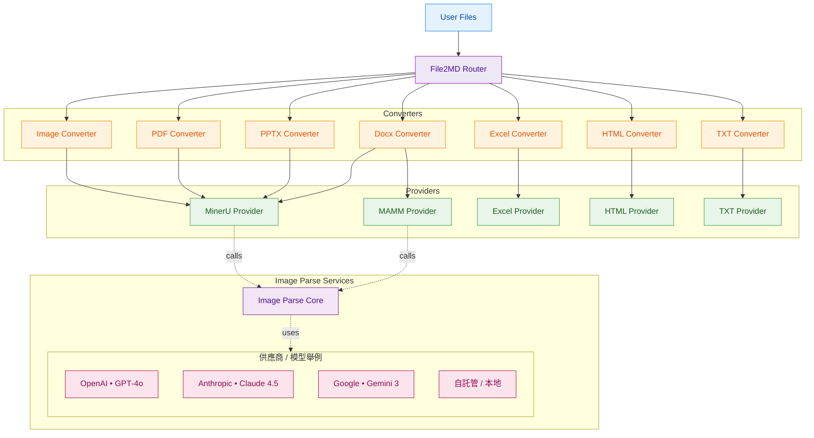

# file2md

一個將多種文件格式轉換為 Markdown 的 Python 工具。

## 支援格式

- **文本格式**: TXT
- **文檔格式**: DOCX
- **表格格式**: Excel (XLSX, CSV)
- **簡報**: PPTX
- **PDF**: PDF 文件
- **圖片**: PNG, JPG 等圖片格式
- **網頁**: HTML

## 安裝

```bash
pip install -r requirements.txt
```

## 快速開始

### 統一街口使用（推薦）

File2MD 提供了統一的入口類，可以自動根據配置文件處理所有支援的文件格式：

```python
from src.app.file2md import File2MD

# 方法 1: 從環境變數或默認配置文件初始化
client = File2MD.from_env(default_path="configs/config.yaml")

# 方法 2: 直接從指定配置文件初始化
client = File2MD.from_yaml("configs/config.yaml")

# 轉換單個或多個文件（自動檢測格式）
results = client.convert([
    "./docs/test.docx", 
    "./data/report.xlsx", 
    "./images/chart.png"
])

# 查看轉換結果
for item in results:
    print(f"檔案: {item.input_path}")
    print(f"格式: {item.fmt}")
    print(f"使用 Provider: {item.provider}")
    print(f"輸出路徑: {item.result.md_path}")

# 也可以指定輸出目錄
results = client.convert(
    input_paths=["./docs/test.docx"],
    output_root="./custom_output"
)
```

#### 配置文件示例

在 `configs/config.yaml` 中配置各種格式的處理方式：

```yaml
file2md:
  output_root: "./output"
  prefer:
    docx: "mammoth"  # 或 "mineru"
    excel: "excel"
    pdf: "mineru"
    pptx: "mineru"
    image: "mineru"
    html: "beautifulsoup"
    txt: "txt"

llm: # parse images
  default_model: "Gemma-3-12B-IT"
  default_config_path: "./configs/models.yaml"
  default_params:
    temperature: 0.2
    max_tokens: 2000

providers:
  mineru:
    base_url: "http://localhost:8962/"
    timeout_sec: 60
    retry: 2
    default_extra:
      backend: "pipeline"
      parse_method: "auto"

converters:
  docx:
    mammoth:
      extra:
        extract_images: true
        keep_output: true
        parse_image: true # parse file images
  pdf:
    mineru:
      extra:
        return_images: true
        keep_unzipped: true
        parse_image: true
```

完整的配置文件範例請參考 [config.example.yaml](configs/config.example.yaml)。

在 `configs/model.yaml` 中配置各種多模態模型:

```yaml
params:
    default:
        temperature: 0.2
        max_tokens: 1000
        top_p: 1
        frequency_penalty: 1.4
        presence_penalty: 0

LLM_engines:
    gpt-4o:
        model: "gpt-4o"
        azure_api_base: 
        azure_api_key: 
        azure_api_version: 
        translate_to_cht: True
    Gemma-3-12B-IT:
        model: "gemma-3-12b-it"
        local_api_key: "Empty"
        local_base_url: "http://10.204.245.170:8963/v1"
        translate_to_cht: True # optional, whether to translate the input to Chinese Traditional
```
完整的配置文件範例請參考 [models.example.yaml](configs/models.example.yaml)。

## 架構



### 基本使用（進階控制）

如需更細緻的控制，每種格式都有對應的 Converter 和 Provider：

#### 1. 轉換文本文件

```python
from src.providers.txt.txt_provider import TxtProvider
from src.converters import TXTConverter
from src.core.types import ProcessOptions

provider = TxtProvider()
converter = TXTConverter(providers=[provider], prefer='txt')

options = ProcessOptions(
    extra={
        'wrap_in_codeblock': False,
        'smart_format': True,
    }
)

result = converter.convert_files(
    input_paths=["txt/test.txt"],
    output_root="./output",
    options=options
)
```

#### 2. 轉換 Excel 文件

```python
from src.converters import ExcelConverter
from src.providers.excel.excel_provider import ExcelProvider
from src.core.types import ProcessOptions

provider = ExcelProvider()
converter = ExcelConverter(providers=[provider], prefer="excel")

result = converter.convert_files(
    input_paths=["data.xlsx", "data.csv"],
    output_root="./output",
    options=ProcessOptions()
)
```

#### 3. 轉換 DOCX 文件

```python
from src.converters import DOCXConverter
from src.providers.docx.mammoth.docx_provider import DOCXMammothProvider
from src.core.types import ProcessOptions

provider = DOCXMammothProvider()
converter = DOCXConverter(providers=[provider], prefer="mammoth")

result = converter.convert_files(
    input_paths=["document.docx"],
    output_root="./output",
    options=ProcessOptions(
        extra={
            "extract_images": True,
            "keep_output": True,
        }
    )
)
```

#### 4. 轉換 HTML 文件

```python
from src.converters.html.html_converter import HTMLConverter
from src.providers.html.html_provider import HTMLBeautifulSoupProvider
from src.core.types import ProcessOptions

provider = HTMLBeautifulSoupProvider()
converter = HTMLConverter(providers=[provider], prefer="beautifulsoup")

result = converter.convert_files(
    input_paths=["page.html"],
    output_root="./output",
    options=ProcessOptions(
        extra={
            'extract_images': True,
            'download_remote_images': False,
        }
    )
)
```

## 主要特性

- **多格式支援**: 支援 7 種常見文件格式
- **Provider 架構**: 靈活的 Provider 設計，可輕鬆擴展
- **多 Provider 支援**: 同一格式可使用不同的處理引擎（如 DOCX 支援 Mammoth 和 MinerU）
- **批量處理**: 一次轉換多個文件
- **可配置選項**: 豐富的轉換選項配置
- **圖片提取**: 支援從文檔中提取圖片

## 進階用法

### 使用 MinerU Provider

PDF、DOC、PPT、IMAGE 格式支援使用 MinerU 作為後端引擎（需要 MinerU 服務）：

#### PDF
```python
from src.providers.pdf.mineru.pdf_provider import PDFMinerUProvider
from src.converters.pdf.pdf_converter import PDFConverter

provider = PDFMinerUProvider(base_url="http://localhost:8962/")
converter = PDFConverter(providers=[provider], prefer="mineru")

result = converter.convert_files(
    input_paths=["document.pdf"],
    output_root="./output",
    options=ProcessOptions(
        extra={
            'backend': 'pipeline',
            'parse_method': 'auto',
            'return_images': True,
        }
    )
)
```

#### DOC
```python
from src.providers.docx.mineru.docx_provider import DocxMinerUProvider
from src.converters import DOCXConverter

provider = DocxMinerUProvider(base_url="http://localhost:8962/")
converter = DOCXConverter(providers=[provider], prefer="mineru")

result = converter.convert_files(
    input_paths=["./docs/test.docx"],
    output_root="./output",
    options=ProcessOptions(
        extra={
            'backend': 'pipeline',
            'parse_method': 'auto',
            'return_images': True,
        }
    )
)
```

#### PPT
```python
from src.providers.pptx.mineru.pptx_provider import PPTXMinerUProvider
from src.converters import PPTXConverter

provider = PPTXMinerUProvider(base_url="http://localhost:8962/")
converter = PPTXConverter(providers=[provider], prefer="mineru")

result = converter.convert_files(
    input_paths=["./pptx/test.pptx"],
    output_root="./output",
    options=ProcessOptions(
        extra={
            'backend': 'pipeline',
            'parse_method': 'auto',
            'return_images': True,
        }
    )
)
```

#### IMAGE
```python
from src.providers.image.mineru.image_provider import ImageMinerUProvider
from src.converters import ImageConverter

provider = ImageMinerUProvider(base_url="http://localhost:8962/")
converter = ImageConverter(providers=[provider], prefer="mineru")

result = converter.convert_files(
    input_paths=["./images/test.png"],
    output_root="./output",
    options=ProcessOptions(
        extra={
            'backend': 'pipeline',
            'parse_method': 'auto',
            'return_images': True,
        }
    )
)
```

