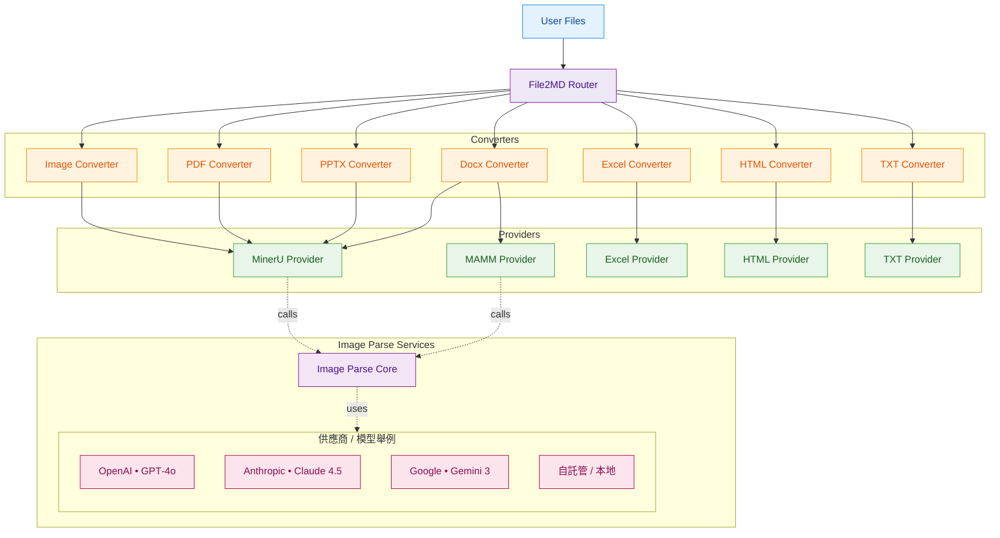

# file2md

一個將多種文件格式轉換為 Markdown 的工具。它支援包括文本、文檔、表格、簡報、PDF、圖片及網頁在內的多種格式，並提供靈活的配置選項與多引擎支援。無論是單一文件還是批量處理，file2md 都能高效完成轉換，並支援從文檔中提取圖片及解析圖片中的內容等進階功能。其模組化架構允許用戶根據需求選擇不同的處理引擎，滿足多樣化的應用場景。

## 支援格式

- **文本格式**: TXT
- **文檔格式**: DOCX
- **表格格式**: Excel (XLSX, CSV)
- **簡報**: PPTX
- **PDF**: PDF 文件
- **圖片**: PNG, JPG 等圖片格式
- **網頁**: HTML

## 安裝

```bash
pip install -r requirements.txt
```

## 快速開始

### 統一接口使用（推薦）

File2MD 提供了統一的入口類，可以自動根據配置文件處理所有支援的文件格式：

```python
from src.app.file2md import File2MD

# 方法 1: 從環境變數或默認配置文件初始化
client = File2MD.from_env(default_path="configs/config.yaml")

# 方法 2: 直接從指定配置文件初始化
client = File2MD.from_yaml("configs/config.yaml")

# 轉換單個或多個文件（自動檢測格式）
results = client.convert([
    "./docs/test.docx", 
    "./data/report.xlsx", 
    "./images/chart.png"
])

# 查看轉換結果
for item in results:
    print(f"檔案: {item.input_path}")
    print(f"格式: {item.fmt}")
    print(f"使用 Provider: {item.provider}")
    print(f"輸出路徑: {item.result.md_path}")

# 也可以指定輸出目錄
results = client.convert(
    input_paths=["./docs/test.docx"],
    output_root="./custom_output"
)
```

#### 配置文件示例

在 `configs/config.yaml` 中配置各種格式的處理方式：

```yaml
file2md:
  output_root: "./output"
  prefer:
    docx: "mammoth"  # 或 "mineru"
    excel: "excel"
    pdf: "mineru"
    pptx: "mineru"
    image: "mineru"
    html: "beautifulsoup"
    txt: "txt"

llm: # parse images
  default_model: "Gemma-3-12B-IT"
  default_config_path: "./configs/models.yaml"
  default_params:
    temperature: 0.2
    max_tokens: 2000

providers:
  mineru:
    base_url: "http://localhost:8962/"
    timeout_sec: 60
    retry: 2
    default_extra:
      backend: "pipeline"
      parse_method: "auto"

converters:
  docx:
    mammoth:
      extra:
        extract_images: true
        keep_output: true
        parse_image: true # parse file images
  pdf:
    mineru:
      extra:
        return_images: true
        keep_unzipped: true
        parse_image: true
```

完整的配置文件範例請參考 [config.example.yaml](configs/config.example.yaml)。

在 `configs/model.yaml` 中配置各種多模態模型:

```yaml
params:
    default:
        temperature: 0.2
        max_tokens: 1000
        top_p: 1
        frequency_penalty: 1.4
        presence_penalty: 0

LLM_engines:
    gpt-4o:
        model: "gpt-4o"
        azure_api_base: 
        azure_api_key: 
        azure_api_version: 
        translate_to_cht: True
    Gemma-3-12B-IT:
        model: "gemma-3-12b-it"
        local_api_key: "Empty"
        local_base_url: "http://10.204.245.170:8963/v1"
        translate_to_cht: True # optional, whether to translate the input to Chinese Traditional
```
完整的配置文件範例請參考 [models.example.yaml](configs/models.example.yaml)。

## API 使用

file2md 提供 RESTful API 服務，可透過 HTTP 請求進行文件轉換。

### 啟動 API 服務

使用提供的啟動腳本來啟動 API 服務：

```bash
bash start_api.sh
```

### 環境變數配置

在啟動 API 前，可以透過環境變數自訂配置：

```bash
# file2md 核心設定
export FILE2MD_CONFIG="./configs/config.yaml"     # 配置文件路徑
export FILE2MD_MAX_BATCH=20                       # 單次請求最多處理的檔案數
export FILE2MD_MAX_CONVERT_INFLIGHT=2             # 同一 worker 並發轉換數
export FILE2MD_TMP_DIR="/tmp/file2md_uploads"     # 上傳暫存資料夾

# MinerU HTTP 客戶端設定
export MINERU_RETRY=3                             # 重試次數
export MINERU_BACKOFF=0.5                         # 重試延遲（秒）
export MINERU_POOL_CONN=32                        # 連線池大小
export MINERU_POOL_MAXSIZE=32                     # 連線池最大大小

# API 伺服器設定
export API_HOST="0.0.0.0"                         # 監聽地址
export API_PORT=8000                              # 監聽埠號
export API_WORKERS=1                              # Worker 進程數

# 啟動服務
bash start_api.sh
```

### API 端點

啟動後，API 服務將在 `http://localhost:8000` 上運行（預設），你可以透過以下方式使用：

- **轉換端點**: `POST http://localhost:8000/convert`
- **API 文檔**: `http://localhost:8000/docs` - Swagger UI 互動式文檔

### API 使用範例

#### 基本使用

```python
import requests

# 轉換單個文件
with open("document.docx", "rb") as f:
    files = {"files": ("document.docx", f, "application/vnd.openxmlformats-officedocument.wordprocessingml.document")}
    data = {"keep_uploads": "false"}  # 是否保留上傳的檔案
    response = requests.post("http://localhost:8000/convert", files=files, data=data)
    result = response.json()
    print(result)

# 批量轉換多個文件
with open("doc1.docx", "rb") as f1, \
     open("data.xlsx", "rb") as f2, \
     open("report.pdf", "rb") as f3:
    files = [
        ("files", ("doc1.docx", f1, "application/vnd.openxmlformats-officedocument.wordprocessingml.document")),
        ("files", ("data.xlsx", f2, "application/vnd.openxmlformats-officedocument.spreadsheetml.sheet")),
        ("files", ("report.pdf", f3, "application/pdf")),
    ]
    data = {"keep_uploads": "false"}
    response = requests.post("http://localhost:8000/convert", files=files, data=data)
    results = response.json().get('results', [])
```

#### 處理返回的圖片

API 支援回傳文件中提取的圖片（以 base64 編碼），範例如下：

```python
import requests
import base64
import os

# 轉換帶有圖片的文件（如 PDF、DOCX 等）
with open("document.pdf", "rb") as f:
    files = {"files": ("document.pdf", f, "application/pdf")}
    data = {"keep_uploads": "false"}
    response = requests.post("http://localhost:8000/convert", files=files, data=data)
    results = response.json().get('results', [])

# 處理每個轉換結果
for idx, result in enumerate(results):
    # 取得 Markdown 內容
    md_content = result.get('md_content')
    if md_content:
        # 儲存 Markdown 檔案
        os.makedirs("output", exist_ok=True)
        with open(f"output/result_{idx}.md", "w", encoding="utf-8") as f:
            f.write(md_content)
        print(f"已儲存 Markdown: output/result_{idx}.md")
    
    # 處理圖片（如果有）
    images = result.get('images', [])
    if images:
        images_dir = f"output/images_{idx}"
        os.makedirs(images_dir, exist_ok=True)
        
        for img_idx, img in enumerate(images):
            # 圖片可能是字典或字串
            b64str = None
            filename = None
            
            if isinstance(img, dict):
                # 嘗試從字典中取得 base64 資料
                for key in ("data", "b64", "base64", "content", "src"):
                    if key in img and img[key]:
                        b64str = img[key]
                        break
                # 嘗試取得檔名
                for key in ("name", "filename", "file", "path"):
                    if key in img and img[key]:
                        filename = img[key]
                        break
            elif isinstance(img, str):
                b64str = img
            
            # 處理 data URI 格式（如 "data:image/png;base64,..."）
            if isinstance(b64str, str) and b64str.startswith("data:") and "," in b64str:
                b64str = b64str.split(",", 1)[1]
            
            if not b64str:
                continue
            
            # 解碼並儲存圖片
            try:
                img_bytes = base64.b64decode(b64str)
                if not filename:
                    filename = f"image_{img_idx}.png"
                
                img_path = os.path.join(images_dir, filename)
                with open(img_path, "wb") as f:
                    f.write(img_bytes)
                print(f"已儲存圖片: {img_path}")
            except Exception as e:
                print(f"解碼圖片失敗: {e}")
```

#### 使用 httpx 進行非同步請求

```python
import asyncio
import httpx
import base64
import os

async def convert_files():
    url = "http://localhost:8000/convert"
    data = {"keep_uploads": "false"}
    
    with open("test.pdf", "rb") as f1, open("test2.pdf", "rb") as f2:
        files = [
            ("files", ("test.pdf", f1, "application/pdf")),
            ("files", ("test2.pdf", f2, "application/pdf")),
        ]
        
        async with httpx.AsyncClient() as client:
            resp = await client.post(url, files=files, data=data, timeout=120.0)
            results = resp.json().get('results', [])
            
            # 處理結果
            for result in results:
                md_content = result.get('md_content')
                images = result.get('images', [])
                # ... 處理 Markdown 和圖片

asyncio.run(convert_files())
```

## 架構



### 基本使用（進階控制）

如需更細緻的控制，每種格式都有對應的 Converter 和 Provider：

#### 1. 轉換文本文件

```python
from src.providers.txt.txt_provider import TxtProvider
from src.converters import TXTConverter
from src.core.types import ProcessOptions

provider = TxtProvider()
converter = TXTConverter(providers=[provider], prefer='txt')

options = ProcessOptions(
    extra={
        'wrap_in_codeblock': False,
        'smart_format': True,
    }
)

result = converter.convert_files(
    input_paths=["txt/test.txt"],
    output_root="./output",
    options=options
)
```

#### 2. 轉換 Excel 文件

```python
from src.converters import ExcelConverter
from src.providers.excel.excel_provider import ExcelProvider
from src.core.types import ProcessOptions

provider = ExcelProvider()
converter = ExcelConverter(providers=[provider], prefer="excel")

result = converter.convert_files(
    input_paths=["data.xlsx", "data.csv"],
    output_root="./output",
    options=ProcessOptions()
)
```

#### 3. 轉換 DOCX 文件

```python
from src.converters import DOCXConverter
from src.providers.docx.mammoth.docx_provider import DOCXMammothProvider
from src.core.types import ProcessOptions

provider = DOCXMammothProvider()
converter = DOCXConverter(providers=[provider], prefer="mammoth")

result = converter.convert_files(
    input_paths=["document.docx"],
    output_root="./output",
    options=ProcessOptions(
        extra={
            "extract_images": True,
            "keep_output": True,
        }
    )
)
```

#### 4. 轉換 HTML 文件

```python
from src.converters.html.html_converter import HTMLConverter
from src.providers.html.html_provider import HTMLBeautifulSoupProvider
from src.core.types import ProcessOptions

provider = HTMLBeautifulSoupProvider()
converter = HTMLConverter(providers=[provider], prefer="beautifulsoup")

result = converter.convert_files(
    input_paths=["page.html"],
    output_root="./output",
    options=ProcessOptions(
        extra={
            'extract_images': True,
            'download_remote_images': False,
        }
    )
)
```

### 使用 MinerU Provider

PDF、DOC、PPT、IMAGE 格式支援使用 MinerU 作為後端引擎（需要 MinerU 服務）：

#### PDF
```python
from src.providers.pdf.mineru.pdf_provider import PDFMinerUProvider
from src.converters.pdf.pdf_converter import PDFConverter

provider = PDFMinerUProvider(base_url="http://localhost:8962/")
converter = PDFConverter(providers=[provider], prefer="mineru")

result = converter.convert_files(
    input_paths=["document.pdf"],
    output_root="./output",
    options=ProcessOptions(
        extra={
            'backend': 'pipeline',
            'parse_method': 'auto',
            'return_images': True,
        }
    )
)
```

#### DOC
```python
from src.providers.docx.mineru.docx_provider import DocxMinerUProvider
from src.converters import DOCXConverter

provider = DocxMinerUProvider(base_url="http://localhost:8962/")
converter = DOCXConverter(providers=[provider], prefer="mineru")

result = converter.convert_files(
    input_paths=["./docs/test.docx"],
    output_root="./output",
    options=ProcessOptions(
        extra={
            'backend': 'pipeline',
            'parse_method': 'auto',
            'return_images': True,
        }
    )
)
```

#### PPT
```python
from src.providers.pptx.mineru.pptx_provider import PPTXMinerUProvider
from src.converters import PPTXConverter

provider = PPTXMinerUProvider(base_url="http://localhost:8962/")
converter = PPTXConverter(providers=[provider], prefer="mineru")

result = converter.convert_files(
    input_paths=["./pptx/test.pptx"],
    output_root="./output",
    options=ProcessOptions(
        extra={
            'backend': 'pipeline',
            'parse_method': 'auto',
            'return_images': True,
        }
    )
)
```

#### IMAGE
```python
from src.providers.image.mineru.image_provider import ImageMinerUProvider
from src.converters import ImageConverter

provider = ImageMinerUProvider(base_url="http://localhost:8962/")
converter = ImageConverter(providers=[provider], prefer="mineru")

result = converter.convert_files(
    input_paths=["./images/test.png"],
    output_root="./output",
    options=ProcessOptions(
        extra={
            'backend': 'pipeline',
            'parse_method': 'auto',
            'return_images': True,
        }
    )
)
```

