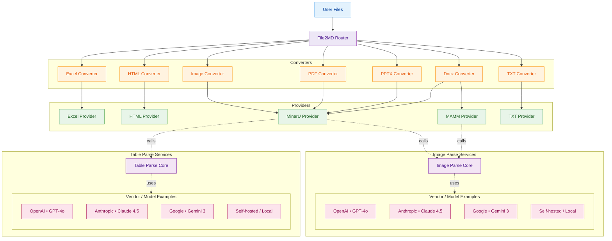

<p align="center">
  
</p>

<div align="center" xmlns="http://www.w3.org/1999/html">

[English](README.md) | [中文](README_zh-CN.md)

</div>

file2md is a versatile tool for converting multiple file formats to Markdown. It supports various formats including text, documents, spreadsheets, presentations, PDFs, images, and web pages, with flexible configuration options and multi-engine support. Whether processing single files or batch conversions, file2md efficiently handles the task while supporting image extraction from documents, image content parsing, and advanced features like optimized table extraction. Its modular architecture allows users to select different processing engines based on their needs, catering to diverse application scenarios.

## Architecture

```mermaid
flowchart TD
    classDef input fill:#E3F2FD,stroke:#1E88E5,color:#0D47A1,stroke-width:1px;
    classDef router fill:#EDE7F6,stroke:#8E24AA,color:#4A148C,stroke-width:1px;
    classDef converter fill:#FFF3E0,stroke:#FB8C00,color:#E65100,stroke-width:1px;
    classDef provider fill:#E8F5E9,stroke:#43A047,color:#1B5E20,stroke-width:1px;
    classDef service fill:#F3E5F5,stroke:#7B1FA2,color:#4A148C,stroke-width:1px;
    classDef vendor fill:#FCE4EC,stroke:#AD1457,color:#880E4F,stroke-width:1px;

    U[User Files]:::input --> FM[File2MD Router]:::router

    subgraph Converters
      direction TB
      DC[Docx Converter]:::converter
      EC[Excel Converter]:::converter
      HC[HTML Converter]:::converter
      IC[Image Converter]:::converter
      PC[PDF Converter]:::converter
      PTC[PPTX Converter]:::converter
      TC[TXT Converter]:::converter
    end

    FM --> DC
    FM --> EC
    FM --> HC
    FM --> IC
    FM --> PC
    FM --> PTC
    FM --> TC

    subgraph Providers
      direction TB
      EP[Excel Provider]:::provider
      HP[HTML Provider]:::provider
      MUP[MinerU Provider]:::provider
      MP[MAMM Provider]:::provider
      TP[TXT Provider]:::provider
    end

    %% Image Parse
    subgraph Image_Parse[Image Parse Services]
      direction TB
      IP[Image Parse Core]:::service

      subgraph LLM_Client[Vendor / Model Examples]
        direction TB
        AOAI[OpenAI • GPT‑4o]:::vendor
        AN[Anthropic • Claude 4.5]:::vendor
        GGL[Google • Gemini 3]:::vendor
        OLL[Self-hosted / Local]:::vendor
      end

      IP -. uses .-> LLM_Client
    end

    %% Table Parse
    subgraph Table_Parse[Table Parse Services]
      direction TB
      TPC[Table Parse Core]:::service

      subgraph LLM_Client_Table[Vendor / Model Examples]
        direction TB
        AOAI_T[OpenAI • GPT‑4o]:::vendor
        AN_T[Anthropic • Claude 4.5]:::vendor
        GGL_T[Google • Gemini 3]:::vendor
        OLL_T[Self-hosted / Local]:::vendor
      end

      TPC -. uses .-> LLM_Client_Table
    end

    %% Text-based files
    EC --> EP
    HC --> HP
    TC --> TP

    %% Image/Layout files (Provider first, then calls IP as needed)
    IC --> MUP
    PC --> MUP
    PTC --> MUP

    DC --> MUP
    DC --> MP

    %% Dependencies (Image Parse)
    MUP -. calls .-> IP
    MP  -. calls .-> IP

    %% Dependencies (Table Parse)
    MUP  -. calls .-> TPC
```

## Supported Formats

- **Text Formats**: TXT
- **Document Formats**: DOCX
- **Spreadsheet Formats**: Excel (XLSX, CSV)
- **Presentations**: PPTX
- **PDF**: PDF files
- **Images**: PNG, JPG and other image formats
- **Web Pages**: HTML

## Feature Requirements

Requirements for additional installation and external services for different features:

| Feature             | Additional Installation | External Service |
| ------------------- | :---------------------: | :--------------: |
| TXT                 |           No            |        No        |
| HTML                |           No            |        No        |
| DOCX (mammoth)      |           No            |        No        |
| DOCX (mineru)       |           Yes           |       Yes        |
| PDF (mineru)        |           Yes           |       Yes        |
| PPT (mineru)        |           Yes           |       Yes        |
| Table VLM parse     |           Yes           |       Yes        |
| Image parse         |           Yes           |       Yes        |

**Notes**:
- **TXT / HTML / DOCX**: Basic features, no additional dependencies required, just install with `pip install -e .[all]`
- **PDF (mineru) / DOCX (mineru) / PPT (mineru)**: Requires MinerU installation, may need external GPU resources (depending on document complexity)
- **Table VLM parse**: Requires starting MinerU VLM service (see installation step 4)
- **Image parse**: Requires configuring LLM/VLM services (OpenAI, Anthropic, local models, etc.)

## Project Structure

```
file2md/
├── src/                          # Source code directory
│   ├── app/                      # Application layer
│   │   ├── file2md.py           # File2MD main class (unified conversion entry)
│   │   ├── config.py            # Configuration management
│   │   ├── http.py              # HTTP client
│   │   └── api/                 # RESTful API implementation
│   ├── converters/              # Format converters
│   │   ├── base_converter.py   # Converter base class
│   │   ├── docx/                # Word document converter
│   │   ├── excel/               # Excel spreadsheet converter
│   │   ├── pdf/                 # PDF converter
│   │   ├── pptx/                # PowerPoint converter
│   │   ├── image/               # Image converter
│   │   ├── html/                # HTML converter
│   │   └── txt/                 # Text converter
│   ├── providers/               # Backend service providers
│   │   ├── pdf/                 # PDF Provider
│   │   ├── pptx/                # PowerPoint Provider
│   │   ├── docx/                # Word document Provider
│   │   ├── image/               # Image Provider
│   │   ├── excel/               # Excel Provider
│   │   ├── html/                # HTML Provider
│   │   └── txt/                 # TXT Provider
│   └── core/                    # Core modules
│       ├── types.py             # Type definitions
│       ├── errors.py            # Error handling
│       └── client/              # Client implementations (LLM, VLM, etc.)
├── configs/                     # Configuration files
│   ├── config.example.yaml      # Configuration example
│   └── models.example.yaml      # Model configuration example
├── test/                        # Test files
├── pyproject.toml               # Project configuration (dependencies, packaging, etc.)
├── start_api.sh                 # API service startup script
└── README.md                    # Project documentation
```

### Core Modules

- **app/file2md.py**: Provides unified `File2MD` class that automatically selects the appropriate converter based on file type
- **converters/**: Each format has a corresponding converter responsible for coordinating providers to complete conversions
- **providers/**: Backend services that actually perform conversions (e.g., MinerU, Mammoth, etc.)
- **core/client/**: LLM and VLM clients for image parsing and table enhancement
- **app/api/**: RESTful API service implemented with FastAPI

## Installation

### Step 1: Install MinerU

```bash
pip install -e .[mineru]
```

### Step 2: Download MinerU Models
For installation and startup details, refer to [MinerU Installation and Startup Guide](src/providers/pdf/mineru/MinerU_Pipeline_啟動指南.md)
```bash
mineru-models-download --model_type pipeline
```

### Step 3: Install Project Dependencies

```bash
pip install -e .[all]
```

### Step 4 (Optional): Start MinerU VLM Service

If you need special table parsing through MinerU VLM, start it via vllm:

```bash
vllm serve opendatalab/MinerU2.5-2509-1.2B --host 0.0.0.0 --port 8000 \
  --logits-processors mineru_vl_utils:MinerULogitsProcessor
```

### Step 5 (Important): Install LibreOffice

**LibreOffice installation is required when using MinerU to process DOCX and PPTX files**

When processing DOCX and PPTX files, MinerU needs to first convert them to PDF via LibreOffice before parsing.

#### Quick Installation (Ubuntu / Debian)

```bash
# Install LibreOffice
apt update
apt install -y libreoffice

# Install Chinese fonts (to avoid garbled characters in converted PDFs)
apt install -y fonts-noto-cjk
```

#### macOS

```bash
brew install --cask libreoffice
```

#### Other Installation Methods

- **Local deb package**: See [LibreOffice Installation Guide](src/providers/docx/LibreOffice_26.2_deb_安裝版指南.md)
- **Other systems**: Refer to [LibreOffice Official Installation Guide](https://www.libreoffice.org/get-help/install-howto/)

## Quick Start

### Unified Interface Usage (Recommended)

File2MD provides a unified entry class that can automatically process all supported file formats based on the configuration file:

```python
from src.app.file2md import File2MD

# Method 1: Initialize from environment variables or default config file
client = File2MD.from_env(default_path="configs/config.yaml")

# Method 2: Initialize directly from a specified config file
client = File2MD.from_yaml("configs/config.yaml")

# Convert single or multiple files (auto-detect format)
results = client.convert([
    "./examples/demo1.pdf"
])

# View conversion results
for item in results:
    print(f"File: {item.input_path}")
    print(f"Format: {item.fmt}")
    print(f"Provider used: {item.provider}")
    print(f"Output path: {item.result.md_path}")
    print(f"Markdown content:\n{item.result.md_text}")

# You can also specify output directory
results = client.convert(
    input_paths=["./examples/demo1.pdf"],
    output_root="./custom_output"
)
```

#### Configuration File Example

Configure processing methods for various formats in `configs/config.yaml`:

```yaml
file2md:
  output_root: "./output"
  prefer:
    docx: "mammoth"  # or "mineru"
    excel: "excel"
    pdf: "mineru"
    pptx: "mineru"
    image: "mineru"
    html: "beautifulsoup"
    txt: "txt"

llm: # parse images
  default_model: "Gemma-3-12B-IT"
  default_config_path: "./configs/models.yaml"
  default_params:
    temperature: 0.2
    max_tokens: 2000

mineru_vlm: # parse table by MinerU2.5-2509-1.2B
  default_server_url: "http://localhost:8963"
  default_backend: "http-client"

providers:
  mineru:
    base_url: "http://localhost:8962/"
    timeout_sec: 60
    retry: 2
    default_extra:
      backend: "pipeline"
      parse_method: "auto"

converters:
  docx:
    mammoth:
      extra:
        extract_images: true
        keep_output: true
        parse_image: true # Whether to use llm(vlm) to parse image content
  pdf:
    mineru:
      extra:
        return_images: true
        keep_unzipped: true
        parse_image: true
        parse_table_w_VLM: true # Whether to use mineru vlm for table parsing (can solve merged cells and complex tables in financial reports)
        table_quality_threshold: 0.55 # Table quality threshold for enhanced table parsing
```

#### Important Parameter Description

**llm Configuration**
- Purpose: Configure language models (VLM) for parsing image content
- `default_model`: Specify model name, must correspond to models defined in `models.yaml`
- `default_config_path`: Model configuration file path
- `default_params`: Model inference parameters
  - `temperature`: Controls output randomness (0-1), lower is more deterministic
  - `max_tokens`: Maximum output length
- Use case: When documents contain images (e.g., charts, diagrams in PDFs, DOCX), use VLM to automatically identify and parse image content into text descriptions

**mineru_vlm Configuration**
- Purpose: Configure MinerU VLM service, specifically for complex table parsing
- `default_server_url`: VLM service address (requires starting MinerU2.5-2509-1.2B model via vllm first)
- `default_backend`: Backend type, usually "http-client"
- Use case: When processing tables with merged cells, complex structures, or financial reports that require more accurate table recognition

**parse_image Parameter**
- Type: Boolean (true/false)
- Purpose: Controls whether to enable image content parsing
- Set to `true`: Use VLM model configured in `llm` to parse image content, converting images to text descriptions
- Set to `false`: Only extract images without content parsing
- Note: Enabling increases processing time and API costs; choose selectively based on needs

**parse_table_w_VLM Parameter**
- Type: Boolean (true/false)
- Purpose: Controls whether to use MinerU VLM for table parsing
- Set to `true`: For complex tables (e.g., merged cells, spanning rows/columns, financial reports), use VLM for deep parsing
- Set to `false`: Use standard table parsing methods
- Advantage: Significantly improves parsing accuracy for complex tables, especially financial and statistical tables
- Prerequisite: Must start MinerU VLM service first (refer to installation step 4)


For complete configuration file examples, see [config.example.yaml](configs/config.example.yaml).

Configure various multimodal models in `configs/model.yaml`:

```yaml
params:
    default:
        temperature: 0.2
        max_tokens: 1000
        top_p: 1
        frequency_penalty: 1.4
        presence_penalty: 0

LLM_engines:
    gpt-4o:
        model: "gpt-4o"
        azure_api_base: 
        azure_api_key: 
        azure_api_version: 
        translate_to_cht: True
    Gemma-3-12B-IT:
        model: "gemma-3-12b-it"
        local_api_key: "Empty"
        local_base_url: "http://10.204.245.170:8963/v1"
        translate_to_cht: True # optional, whether to translate the input to Chinese Traditional
```
For complete configuration file examples, see [models.example.yaml](configs/models.example.yaml).

## API Usage

file2md provides a RESTful API service for file conversion via HTTP requests.

### Starting the API Service

Use the provided startup script to start the API service:

```bash
bash start_api.sh
```

### Environment Variable Configuration

Before starting the API, you can customize the configuration via environment variables:

```bash
# file2md core configuration
export FILE2MD_CONFIG="./configs/config.yaml"     # Configuration file path
export FILE2MD_MAX_BATCH=20                       # Maximum files per request
export FILE2MD_MAX_CONVERT_INFLIGHT=2             # Concurrent conversions per worker
export FILE2MD_TMP_DIR="/tmp/file2md_uploads"     # Upload temporary directory

# MinerU HTTP client configuration
export MINERU_RETRY=3                             # Retry count
export MINERU_BACKOFF=0.5                         # Retry delay (seconds)
export MINERU_POOL_CONN=32                        # Connection pool size
export MINERU_POOL_MAXSIZE=32                     # Max connection pool size

# API server configuration
export API_HOST="0.0.0.0"                         # Listen address
export API_PORT=8000                              # Listen port
export API_WORKERS=1                              # Worker process count

# Start service
bash start_api.sh
```

### API Endpoints

Once started, the API service will run on `http://localhost:8000` (default), and you can use it via:

- **Conversion endpoint**: `POST http://localhost:8000/convert`
- **API documentation**: `http://localhost:8000/docs` - Swagger UI interactive documentation

### API Usage Examples

#### Basic Usage

```python
import requests

# Convert single file
with open("document.docx", "rb") as f:
    files = {"files": ("document.docx", f, "application/vnd.openxmlformats-officedocument.wordprocessingml.document")}
    data = {"keep_uploads": "false"}  # Whether to keep uploaded files
    response = requests.post("http://localhost:8000/convert", files=files, data=data)
    result = response.json()
    print(result)

# Batch convert multiple files
with open("doc1.docx", "rb") as f1, \
     open("data.xlsx", "rb") as f2, \
     open("report.pdf", "rb") as f3:
    files = [
        ("files", ("doc1.docx", f1, "application/vnd.openxmlformats-officedocument.wordprocessingml.document")),
        ("files", ("data.xlsx", f2, "application/vnd.openxmlformats-officedocument.spreadsheetml.sheet")),
        ("files", ("report.pdf", f3, "application/pdf")),
    ]
    data = {"keep_uploads": "false"}
    response = requests.post("http://localhost:8000/convert", files=files, data=data)
    results = response.json().get('results', [])
```

#### Processing Returned Images

The API supports returning images extracted from documents (encoded in base64), example:

```python
import requests
import base64
import os

# Convert files with images (e.g., PDF, DOCX, etc.)
with open("document.pdf", "rb") as f:
    files = {"files": ("document.pdf", f, "application/pdf")}
    data = {"keep_uploads": "false"}
    response = requests.post("http://localhost:8000/convert", files=files, data=data)
    results = response.json().get('results', [])

# Process each conversion result
for idx, result in enumerate(results):
    # Get Markdown content
    md_content = result.get('md_content')
    if md_content:
        # Save Markdown file
        os.makedirs("output", exist_ok=True)
        with open(f"output/result_{idx}.md", "w", encoding="utf-8") as f:
            f.write(md_content)
        print(f"Saved Markdown: output/result_{idx}.md")
    
    # Process images (if any)
    images = result.get('images', [])
    if images:
        images_dir = f"output/images_{idx}"
        os.makedirs(images_dir, exist_ok=True)
        
        for img_idx, img in enumerate(images):
            # Image may be dictionary or string
            b64str = None
            filename = None
            
            if isinstance(img, dict):
                # Try to get base64 data from dictionary
                for key in ("data", "b64", "base64", "content", "src"):
                    if key in img and img[key]:
                        b64str = img[key]
                        break
                # Try to get filename
                for key in ("name", "filename", "file", "path"):
                    if key in img and img[key]:
                        filename = img[key]
                        break
            elif isinstance(img, str):
                b64str = img
            
            # Handle data URI format (e.g., "data:image/png;base64,...")
            if isinstance(b64str, str) and b64str.startswith("data:") and "," in b64str:
                b64str = b64str.split(",", 1)[1]
            
            if not b64str:
                continue
            
            # Decode and save image
            try:
                img_bytes = base64.b64decode(b64str)
                if not filename:
                    filename = f"image_{img_idx}.png"
                
                img_path = os.path.join(images_dir, filename)
                with open(img_path, "wb") as f:
                    f.write(img_bytes)
                print(f"Saved image: {img_path}")
            except Exception as e:
                print(f"Failed to decode image: {e}")
```

#### Using httpx for Async Requests

```python
import asyncio
import httpx
import base64
import os

async def convert_files():
    url = "http://localhost:8000/convert"
    data = {"keep_uploads": "false"}
    
    with open("test.pdf", "rb") as f1, open("test2.pdf", "rb") as f2:
        files = [
            ("files", ("test.pdf", f1, "application/pdf")),
            ("files", ("test2.pdf", f2, "application/pdf")),
        ]
        
        async with httpx.AsyncClient() as client:
            resp = await client.post(url, files=files, data=data, timeout=120.0)
            results = resp.json().get('results', [])
            
            # Process results
            for result in results:
                md_content = result.get('md_content')
                images = result.get('images', [])
                # ... Process Markdown and images

asyncio.run(convert_files())
```

## License

This project is licensed under the MIT License.