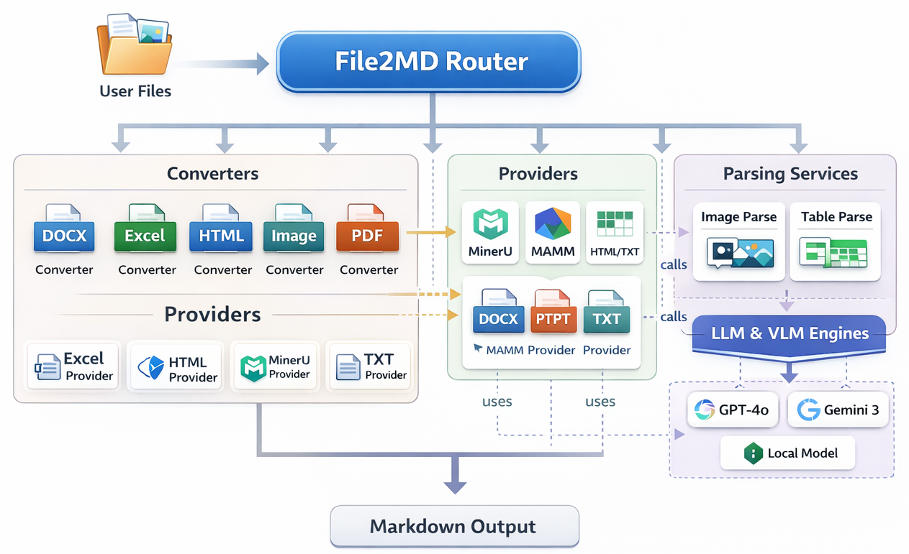
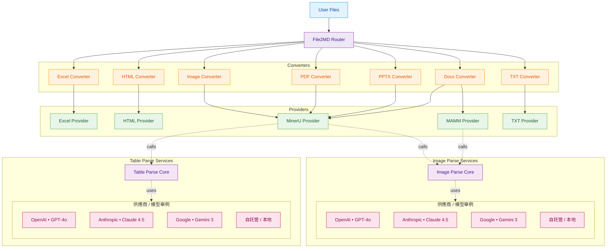

<p align="center">
  
</p>

file2md是一個將多種文件格式轉換為 Markdown 的工具。它支援包括文本、文檔、表格、簡報、PDF、圖片及網頁在內的多種格式，並提供靈活的配置選項與多引擎支援。無論是單一文件還是批量處理，file2md 都能高效完成轉換，並支援從文檔中提取圖片及解析圖片中的內容，以及優化表格擷取等進階功能。其模組化架構允許用戶根據需求選擇不同的處理引擎，滿足多樣化的應用場景。

## 架構


## 支援格式

- **文本格式**: TXT
- **文檔格式**: DOCX
- **表格格式**: Excel (XLSX, CSV)
- **簡報**: PPTX
- **PDF**: PDF 文件
- **圖片**: PNG, JPG 等圖片格式
- **網頁**: HTML

## 功能需求對照

不同功能對於額外安裝和外部服務的需求說明：

| 功能              | 是否需要額外安裝 | 是否需要外部服務 |
| --------------- | -------: | -------: |
| TXT             |        否 |        否 |
| HTML            |        否 |        否 |
| DOCX (mammoth)  |        否 |        否 |
| DOCX (mineru)    |        是 |        是 |
| PDF (mineru)    |        是 |        是 |
| PPT (mineru)    |        是 |        是 |
| Table VLM parse |        是 |        是 |
| Image parse     |        是 |        是 |

**說明**：
- **TXT / HTML / DOCX**：基礎功能，無需額外依賴，只需要安裝 `pip install -e .[all]` 即可
- **PDF (mineru) / DOCX (mineru) / PPT (mineru)**：需要安裝 MinerU，可能需要外部 GPU 資源（視文件複雜度）
- **Table VLM parse**：需要啟動 MinerU VLM 服務（見安裝步驟第四步）
- **Image parse**：需要配置 LLM/VLM 服務（OpenAI、Anthropic、本地模型等）

## 專案結構

```
file2md/
├── src/                          # 源代碼目錄
│   ├── app/                      # 應用層
│   │   ├── file2md.py           # File2MD 主類（統一轉換入口）
│   │   ├── config.py            # 配置管理
│   │   ├── http.py              # HTTP 客戶端
│   │   └── api/                 # RESTful API 實現
│   ├── converters/              # 格式轉換器
│   │   ├── base_converter.py   # 轉換器基類
│   │   ├── docx/                # Word 文檔轉換器
│   │   ├── excel/               # Excel 表格轉換器
│   │   ├── pdf/                 # PDF 轉換器
│   │   ├── pptx/                # PowerPoint 轉換器
│   │   ├── image/               # 圖片轉換器
│   │   ├── html/                # HTML 轉換器
│   │   └── txt/                 # 文本轉換器
│   ├── providers/               # 後端服務提供者
│   │   ├── pdf/                 # PDF Provider
│   │   ├── pptx/                # PowerPoint Provider
│   │   ├── docx/                # Word document Provider
│   │   ├── image/               # Image Provider
│   │   ├── excel/               # Excel Provider
│   │   ├── html/                # HTML Provider
│   │   └── txt/                 # TXT Provider
│   └── core/                    # 核心模組
│       ├── types.py             # 類型定義
│       ├── errors.py            # 錯誤處理
│       └── client/              # 客戶端實現（LLM、VLM等）
├── configs/                     # 配置文件
│   ├── config.example.yaml      # 配置範例
│   └── models.example.yaml      # 模型配置範例
├── test/                        # 測試文件
├── pyproject.toml               # 專案配置（依賴、打包等）
├── start_api.sh                 # API 服務啟動腳本
└── README.md                    # 專案說明文檔
```

### 核心模組說明

- **app/file2md.py**: 提供統一的 `File2MD` 類，自動根據文件類型選擇對應的轉換器
- **converters/**: 每種格式都有對應的轉換器，負責協調 Provider 完成轉換
- **providers/**: 實際執行轉換的後端服務（如 MinerU、Mammoth 等）
- **core/client/**: LLM 和 VLM 客戶端，用於圖片解析和表格增強
- **app/api/**: FastAPI 實現的 RESTful API 服務

## 安裝

### 第一步：安裝 MinerU

```bash
pip install -e .[mineru]
```

### 第二步：下載 MinerU 相關模型
安裝&啟動細節可參考 [MinerU 安裝啟動指南](src/providers/pdf/mineru/MinerU_Pipeline_啟動指南.md)
```bash
mineru-models-download --model_type pipeline
```

### 第三步：安裝項目相關依賴

```bash
pip install -e .[all]
```

### 第四步（可選）：啟動 MinerU VLM 服務

如果需要透過 MinerU VLM 針對表格進行特別解析，請透過 vllm 啟動：

```bash
vllm serve opendatalab/MinerU2.5-2509-1.2B --host 0.0.0.0 --port 8000 \
  --logits-processors mineru_vl_utils:MinerULogitsProcessor
```

### 第五步（重要）：安裝 LibreOffice

**使用 MinerU 處理 DOCX 和 PPTX 文件時必須安裝 LibreOffice**

MinerU 在處理 DOCX 和 PPTX 文件時，需要先透過 LibreOffice 將其轉換為 PDF，再進行解析。

#### 快速安裝（Ubuntu / Debian）

```bash
# 安裝 LibreOffice
apt update
apt install -y libreoffice

# 安裝中文字型（避免轉換後的 PDF 出現中文亂碼）
apt install -y fonts-noto-cjk
```

#### macOS 系統

```bash
brew install --cask libreoffice
```

#### 其他安裝方式

- **本地 deb 安裝包**：詳見 [LibreOffice 安裝指南](src/providers/docx/LibreOffice_26.2_deb_安裝版指南.md)
- **其他系統**：請參考 [LibreOffice 官方安裝指南](https://www.libreoffice.org/get-help/install-howto/)

## 快速開始

### 統一接口使用（推薦）

File2MD 提供了統一的入口類，可以自動根據配置文件處理所有支援的文件格式：

```python
from src.app.file2md import File2MD

# 方法 1: 從環境變數或默認配置文件初始化
client = File2MD.from_env(default_path="configs/config.yaml")

# 方法 2: 直接從指定配置文件初始化
client = File2MD.from_yaml("configs/config.yaml")

# 轉換單個或多個文件（自動檢測格式）
results = client.convert([
    "./examples/demo1.pdf"
])

# 查看轉換結果
for item in results:
    print(f"檔案: {item.input_path}")
    print(f"格式: {item.fmt}")
    print(f"使用 Provider: {item.provider}")
    print(f"輸出路徑: {item.result.md_path}")
    print(f"Markdown 內容:\n{item.result.md_text}")

# 也可以指定輸出目錄
results = client.convert(
    input_paths=["./examples/demo1.pdf"],
    output_root="./custom_output"
)
```

#### 配置文件示例

在 `configs/config.yaml` 中配置各種格式的處理方式：

```yaml
file2md:
  output_root: "./output"
  prefer:
    docx: "mammoth"  # 或 "mineru"
    excel: "excel"
    pdf: "mineru"
    pptx: "mineru"
    image: "mineru"
    html: "beautifulsoup"
    txt: "txt"

llm: # parse images
  default_model: "Gemma-3-12B-IT"
  default_config_path: "./configs/models.yaml"
  default_params:
    temperature: 0.2
    max_tokens: 2000

mineru_vlm: # parse table by MinerU2.5-2509-1.2B
  default_server_url: "http://localhost:8963"
  default_backend: "http-client"

providers:
  mineru:
    base_url: "http://localhost:8962/"
    timeout_sec: 60
    retry: 2
    default_extra:
      backend: "pipeline"
      parse_method: "auto"

converters:
  docx:
    mammoth:
      extra:
        extract_images: true
        keep_output: true
        parse_image: true # 是否使用 llm(vlm) 解析圖片內容
  pdf:
    mineru:
      extra:
        return_images: true
        keep_unzipped: true
        parse_image: true
        parse_table_w_VLM: true # 是否使用 mineru vlm 進行表格解析(可以解決一些財務表格中的合併儲存格跟負責表格)
        table_quality_threshold: 0.55 # 檢查表格品質threshold，可增強表格解析
```

#### 重要參數說明

**llm 配置**
- 用途：配置用於解析圖片內容的語言模型（VLM）
- `default_model`: 指定使用的模型名稱，需對應 `models.yaml` 中定義的模型
- `default_config_path`: 模型配置文件路徑
- `default_params`: 模型推理參數
  - `temperature`: 控制輸出隨機性（0-1），越低越確定
  - `max_tokens`: 最大輸出長度
- 應用場景：當文件中包含圖片（如 PDF、DOCX 中的圖表、示意圖等）時，使用 VLM 自動識別並解析圖片內容轉為文字描述

**mineru_vlm 配置**
- 用途：配置 MinerU VLM 服務，專門用於複雜表格解析
- `default_server_url`: VLM 服務地址（需先透過 vllm 啟動 MinerU2.5-2509-1.2B 模型）
- `default_backend`: 後端類型，通常使用 "http-client"
- 應用場景：處理包含合併儲存格、複雜結構或財務報表等高難度表格時，提供更精確的表格識別能力

**parse_image 參數**
- 類型：布林值（true/false）
- 用途：控制是否啟用圖片內容解析
- 設為 `true`: 使用 `llm` 配置中的 VLM 模型解析圖片內容，將圖片轉為文字描述
- 設為 `false`: 僅提取圖片但不進行內容解析
- 注意：啟用後會增加處理時間和 API 成本，建議根據需求選擇性啟用

**parse_table_w_VLM 參數**
- 類型：布林值（true/false）
- 用途：控制是否使用 MinerU VLM 進行表格解析
- 設為 `true`: 對於複雜表格（如合併儲存格、跨行跨列、財務報表等）使用 VLM 進行深度解析
- 設為 `false`: 使用標準表格解析方法
- 優勢：可大幅提升複雜表格的解析準確度，特別是財務、統計類表格
- 前提：需要先啟動 MinerU VLM 服務（參考安裝步驟第四步）


完整的配置文件範例請參考 [config.example.yaml](configs/config.example.yaml)。

在 `configs/model.yaml` 中配置各種多模態模型:

```yaml
params:
    default:
        temperature: 0.2
        max_tokens: 1000
        top_p: 1
        frequency_penalty: 1.4
        presence_penalty: 0

LLM_engines:
    gpt-4o:
        model: "gpt-4o"
        azure_api_base: 
        azure_api_key: 
        azure_api_version: 
        translate_to_cht: True
    Gemma-3-12B-IT:
        model: "gemma-3-12b-it"
        local_api_key: "Empty"
        local_base_url: "http://10.204.245.170:8963/v1"
        translate_to_cht: True # optional, whether to translate the input to Chinese Traditional
```
完整的配置文件範例請參考 [models.example.yaml](configs/models.example.yaml)。

## API 使用

file2md 提供 RESTful API 服務，可透過 HTTP 請求進行文件轉換。

### 啟動 API 服務

使用提供的啟動腳本來啟動 API 服務：

```bash
bash start_api.sh
```

### 環境變數配置

在啟動 API 前，可以透過環境變數自訂配置：

```bash
# file2md 核心設定
export FILE2MD_CONFIG="./configs/config.yaml"     # 配置文件路徑
export FILE2MD_MAX_BATCH=20                       # 單次請求最多處理的檔案數
export FILE2MD_MAX_CONVERT_INFLIGHT=2             # 同一 worker 並發轉換數
export FILE2MD_TMP_DIR="/tmp/file2md_uploads"     # 上傳暫存資料夾

# MinerU HTTP 客戶端設定
export MINERU_RETRY=3                             # 重試次數
export MINERU_BACKOFF=0.5                         # 重試延遲（秒）
export MINERU_POOL_CONN=32                        # 連線池大小
export MINERU_POOL_MAXSIZE=32                     # 連線池最大大小

# API 伺服器設定
export API_HOST="0.0.0.0"                         # 監聽地址
export API_PORT=8000                              # 監聽埠號
export API_WORKERS=1                              # Worker 進程數

# 啟動服務
bash start_api.sh
```

### API 端點

啟動後，API 服務將在 `http://localhost:8000` 上運行（預設），你可以透過以下方式使用：

- **轉換端點**: `POST http://localhost:8000/convert`
- **API 文檔**: `http://localhost:8000/docs` - Swagger UI 互動式文檔

### API 使用範例

#### 基本使用

```python
import requests

# 轉換單個文件
with open("document.docx", "rb") as f:
    files = {"files": ("document.docx", f, "application/vnd.openxmlformats-officedocument.wordprocessingml.document")}
    data = {"keep_uploads": "false"}  # 是否保留上傳的檔案
    response = requests.post("http://localhost:8000/convert", files=files, data=data)
    result = response.json()
    print(result)

# 批量轉換多個文件
with open("doc1.docx", "rb") as f1, \
     open("data.xlsx", "rb") as f2, \
     open("report.pdf", "rb") as f3:
    files = [
        ("files", ("doc1.docx", f1, "application/vnd.openxmlformats-officedocument.wordprocessingml.document")),
        ("files", ("data.xlsx", f2, "application/vnd.openxmlformats-officedocument.spreadsheetml.sheet")),
        ("files", ("report.pdf", f3, "application/pdf")),
    ]
    data = {"keep_uploads": "false"}
    response = requests.post("http://localhost:8000/convert", files=files, data=data)
    results = response.json().get('results', [])
```

#### 處理返回的圖片

API 支援回傳文件中提取的圖片（以 base64 編碼），範例如下：

```python
import requests
import base64
import os

# 轉換帶有圖片的文件（如 PDF、DOCX 等）
with open("document.pdf", "rb") as f:
    files = {"files": ("document.pdf", f, "application/pdf")}
    data = {"keep_uploads": "false"}
    response = requests.post("http://localhost:8000/convert", files=files, data=data)
    results = response.json().get('results', [])

# 處理每個轉換結果
for idx, result in enumerate(results):
    # 取得 Markdown 內容
    md_content = result.get('md_content')
    if md_content:
        # 儲存 Markdown 檔案
        os.makedirs("output", exist_ok=True)
        with open(f"output/result_{idx}.md", "w", encoding="utf-8") as f:
            f.write(md_content)
        print(f"已儲存 Markdown: output/result_{idx}.md")
    
    # 處理圖片（如果有）
    images = result.get('images', [])
    if images:
        images_dir = f"output/images_{idx}"
        os.makedirs(images_dir, exist_ok=True)
        
        for img_idx, img in enumerate(images):
            # 圖片可能是字典或字串
            b64str = None
            filename = None
            
            if isinstance(img, dict):
                # 嘗試從字典中取得 base64 資料
                for key in ("data", "b64", "base64", "content", "src"):
                    if key in img and img[key]:
                        b64str = img[key]
                        break
                # 嘗試取得檔名
                for key in ("name", "filename", "file", "path"):
                    if key in img and img[key]:
                        filename = img[key]
                        break
            elif isinstance(img, str):
                b64str = img
            
            # 處理 data URI 格式（如 "data:image/png;base64,..."）
            if isinstance(b64str, str) and b64str.startswith("data:") and "," in b64str:
                b64str = b64str.split(",", 1)[1]
            
            if not b64str:
                continue
            
            # 解碼並儲存圖片
            try:
                img_bytes = base64.b64decode(b64str)
                if not filename:
                    filename = f"image_{img_idx}.png"
                
                img_path = os.path.join(images_dir, filename)
                with open(img_path, "wb") as f:
                    f.write(img_bytes)
                print(f"已儲存圖片: {img_path}")
            except Exception as e:
                print(f"解碼圖片失敗: {e}")
```

#### 使用 httpx 進行非同步請求

```python
import asyncio
import httpx
import base64
import os

async def convert_files():
    url = "http://localhost:8000/convert"
    data = {"keep_uploads": "false"}
    
    with open("test.pdf", "rb") as f1, open("test2.pdf", "rb") as f2:
        files = [
            ("files", ("test.pdf", f1, "application/pdf")),
            ("files", ("test2.pdf", f2, "application/pdf")),
        ]
        
        async with httpx.AsyncClient() as client:
            resp = await client.post(url, files=files, data=data, timeout=120.0)
            results = resp.json().get('results', [])
            
            # 處理結果
            for result in results:
                md_content = result.get('md_content')
                images = result.get('images', [])
                # ... 處理 Markdown 和圖片

asyncio.run(convert_files())
```

## License

This project is licensed under the MIT License.